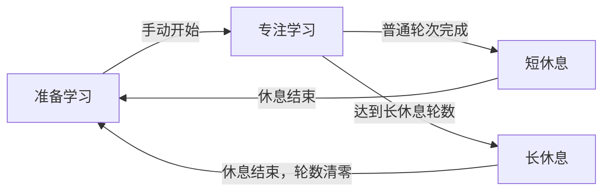

# WearPomodoro · 腕上番茄钟

[](docs/assets/app-icon.svg)

简体中文 | [English](README_en.md)

[](app/build.gradle.kts)
[](gradle/libs.versions.toml)
[](LICENSE)

一款面向 Android 智能手表的独立番茄钟，使用 Kotlin、Jetpack Compose 和 Wear Compose Material 3 构建。通过专注、短休息和长休息安排学习节奏，无需账号或配套手机应用。

## 功能

- **完整计时流程**：开始、暂停、继续，以及带确认的停止操作；显示剩余时间、本轮进度和轮数。
- **自定义节奏**：分别设置学习、短休息和长休息时长，调整长休息间隔，或关闭长休息。
- **后台计时与提醒**：前台服务配合系统闹钟处理阶段切换，常驻通知支持暂停、继续和停止，到点发送通知及振动提醒。
- **手表交互**：圆屏进度环、横向分页、滚轮选择器与表冠交互，可配置系统返回和右滑返回行为。
- **本地保存**：使用 DataStore 保存设置和计时状态，支持进程重建后的状态恢复。
- **中英双语与触觉适配**：提供中文、英文资源，内置 Google / 小米 Wear 滚动触觉兼容层。

## 使用方式

主界面从左到右依次为 **计时、计时设置、通用设置**，左右滑动即可切换。在计时页点击开始按钮进入学习。

| 设置 | 默认值 | 可选范围 |
| --- | --- | --- |
| 学习时长 | 25 分钟 | 1 分钟至 23 小时 59 分钟 |
| 短休息时长 | 5 分钟 | 1 分钟至 23 小时 59 分钟 |
| 长休息时长 | 15 分钟 | 1 分钟至 23 小时 59 分钟 |
| 长休息轮数 | 每 4 轮学习后 | 2–12 轮，或「总不」 |



- 学习结束会自动开始休息；休息结束后等待手动开始下一轮学习。短休息保留累计轮数，长休息结束后清零。
- 在计时页先暂停，再点击停止并确认，会清空本轮进度和累计轮数。通知中的停止操作需要在 10 秒内再次点击确认。
- 时长修改在下一次开始学习时采用；当前学习及其休息仍使用本轮开始时保存的时长。长休息轮数修改会立即参与后续休息类型的判断。
- 设备重启后，应用收到开机广播时会回到待开始状态，保留设置并重置计时进度与轮数。

通用设置提供权限检查、系统应用设置、返回手势配置和关于页面。在 Android 16 / Wear OS 6（API 36）及以上系统中，右滑返回由「系统返回手势」统一控制；较旧系统可分别设置。

## 设备与兼容性

- 面向 Android 智能手表，要求设备具备 `android.hardware.type.watch` 特性；最低系统要求以 [应用构建配置](app/build.gradle.kts) 中的 `minSdk` 为准。
- 默认生成 `armeabi-v7a`、`arm64-v8a` 和包含这两种架构的通用 APK。
- 内置的 [miwearhaptics](miwearhaptics/README.md) 主要面向中国大陆版小米手表 5 / 5 eSIM 的 Wear 触觉适配。默认优先使用可调用的 Google 接口，再回退到小米接口；两者均不可用时不提供对应滚动触觉。

最低 API 配置不代表所有机型、固件均已通过验证。滚动触觉取决于系统提供的 Wear SDK，与阶段完成时的通知振动分别处理。

## 权限与提醒

可在 **通用设置 → 权限检查** 查看状态并打开相应系统设置。

| 权限 | 用途与操作 |
| --- | --- |
| 通知 `POST_NOTIFICATIONS` | 显示计时和阶段提醒；Android 13 / API 33 及以上需要运行时授权，也需保持系统通知开关开启。 |
| 精确闹钟 `SCHEDULE_EXACT_ALARM` | 用于熄屏后的到点处理；Android 12 / API 31 及以上可从权限页进入系统特殊访问设置。 |
| 前台服务 `FOREGROUND_SERVICE`、`FOREGROUND_SERVICE_SPECIAL_USE` | 运行计时服务，由应用清单声明，按系统版本检查。 |

清单还声明开机广播、振动和唤醒锁权限。这些项目不都需要用户手动授权，权限页会区分已开启、待开启和当前系统无需申请。

未获得精确闹钟权限时会回退到非精确闹钟，提醒可能延迟。通知或阶段提醒通道被关闭、振动被禁用时，相应提醒也会受到影响；后台运行还取决于设备的电池管理策略。

计时无需联网，设置和计时状态保存在本地 DataStore。关于页面的网页链接交由外部应用打开。

## 从源码构建

### 环境

构建时使用仓库自带的 Gradle Wrapper，应用信息与构建环境要求以以下配置文件为准：

| 配置来源 | 内容 |
| --- | --- |
| [应用构建配置](app/build.gradle.kts) | 应用信息、Android SDK 要求、Java / Kotlin 编译目标 |
| [依赖版本目录](gradle/libs.versions.toml) | Android Gradle Plugin、Kotlin、Wear Compose 等依赖 |
| [Wrapper 配置](gradle/wrapper/gradle-wrapper.properties) | Gradle 发行版 |
| [JVM 配置](gradle/gradle-daemon-jvm.properties) | Gradle 守护进程所需的 JDK |

根据上述配置准备 JDK 和 Android SDK；安装到设备还需要 SDK Platform-Tools 中的 `adb`。也可以使用支持项目 AGP 配置的 Android Studio 打开项目。首次构建需要联网下载 Gradle 和依赖，缺失的 JDK 工具链也可能被自动下载。

### 构建调试包

1. 克隆或下载本仓库，保留完整的 `miwearhaptics/` 目录；它通过 Gradle included build 参与插件和运行时依赖解析。
2. 在 Android Studio 中配置 SDK，或在根目录的 `local.properties` 中设置 `sdk.dir` 为本机 SDK 路径，例如 Windows 的 `sdk.dir=C:/Android/Sdk`。该文件不应提交到版本控制。
3. 在项目根目录执行构建。

Windows / PowerShell：

```powershell
.\gradlew.bat :app:assembleDebug
```

macOS / Linux：

```bash
./gradlew :app:assembleDebug
```

调试 APK 输出到 `app/build/outputs/apk/debug/`，包括 `app-armeabi-v7a-debug.apk`、`app-arm64-v8a-debug.apk` 和 `app-universal-debug.apk`。

### Release 构建

Windows / PowerShell：

```powershell
.\gradlew.bat :app:assembleRelease
```

macOS / Linux：

```bash
./gradlew :app:assembleRelease
```

Release APK 输出到 `app/build/outputs/apk/release/`，文件名为 `WearPomodoro-<版本号>-<ABI>.apk`，其中 ABI 为 `armeabi-v7a`、`arm64-v8a` 或 `universal`。

Release 启用了代码压缩和资源缩减。

### GitHub Release

将新建的 Git 标签推送到 GitHub 后，[发布工作流](.github/workflows/release.yml) 会按 CI 的方式构建 Debug APK，自动生成发行说明，并将 APK 附加到对应标签的 GitHub Release；Actions 产物也仅包含 APK。APK 中的应用版本仍由 [应用构建配置](app/build.gradle.kts) 决定。

## 项目结构

```text
.
├── .github/                       # Issue / PR 模板、贡献指南与赞助配置
├── app/
│   ├── build.gradle.kts            # Android 应用与 APK 输出配置
│   └── src/main/
│       ├── AndroidManifest.xml
│       ├── java/cc/star0/wear/pomodoro/
│       │   ├── model/              # 设置、状态与纯计时转换逻辑
│       │   ├── data/               # DataStore 持久化
│       │   ├── timer/              # 控制器、前台服务与开机处理
│       │   ├── notifications/      # 常驻通知和阶段提醒
│       │   ├── permissions/        # 权限检查与状态报告
│       │   ├── text/               # UI / 通知共用文本格式化
│       │   └── ui/                 # Compose 页面、导航与交互
│       └── res/                    # 中英文资源、图标及图片
├── docs/assets/                   # README 使用的应用图标
├── miwearhaptics/                  # 独立 Gradle 插件与 Java 运行时库
├── gradle/                        # 版本目录、Wrapper 与 JVM 配置
├── settings.gradle.kts
├── README.md
├── README_en.md
└── AGENT.md                       # 开发与代理协作指南
```

## 参与开发

欢迎提交 Issue 和 Pull Request。问题反馈请附上设备型号、固件 / Android 版本、应用版本、复现步骤及相关日志；界面问题可附截图。

具体流程见 [贡献指南](.github/CONTRIBUTING.md)，提交 Issue 时可选择问题反馈或功能建议模板。

修改前请阅读 [AGENT.md](AGENT.md)。修改触觉插件时，同时参考其 [维护指南](miwearhaptics/AGENT.md)。常用代码检查命令为：

```powershell
.\gradlew.bat :app:assembleDebug :app:lintDebug
```

macOS / Linux 将命令入口换为 `./gradlew`。当前仓库没有自动化测试源码；涉及计时、通知、手势或触觉的修改，还应在目标设备上验证。功能和构建方式变化时，请同步更新两种语言的 README。

## 赞助

如果这个项目对你有帮助，欢迎通过 Ko-fi 或微信赞赏支持开发。

[](https://ko-fi.com/I1J826UQFX)

微信赞赏码：

[](app/src/main/res/drawable-nodpi/tipcode.jpg)

## 作者与许可证

作者：**星澪 Star_ZER0** · [个人主页](https://star0.cc)。本应用由 AI 辅助编写。

- 主项目采用 **GNU AGPL v3**，详见 [LICENSE](LICENSE)。
- 内置 `miwearhaptics` 使用其独立的 **GNU LGPL v3** 许可证，详见 [miwearhaptics/LICENSE](miwearhaptics/LICENSE)。
