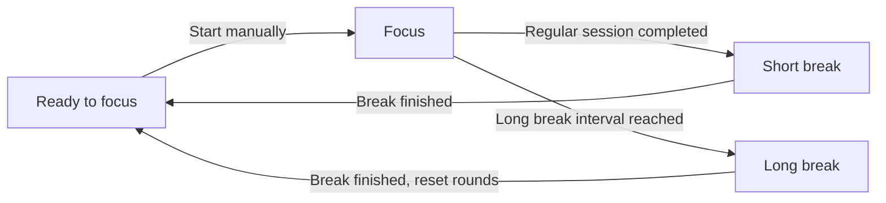

# WearPomodoro

[](docs/assets/app-icon.svg)

[简体中文](README.md) | English

[](app/build.gradle.kts)
[](gradle/libs.versions.toml)
[](LICENSE)

A standalone Pomodoro timer for Android watches, built with Kotlin, Jetpack Compose, and Wear Compose Material 3. Organize your time into focus sessions, short breaks, and long breaks without an account or a companion phone app.

## Features

- **Timer controls**: start, pause, resume, and stop with confirmation; see the remaining time, session progress, and round count.
- **Adjustable sessions**: customize focus and break durations, choose a long break interval, or disable long breaks.
- **Background timing and reminders**: a foreground service and system alarms handle phase changes. The ongoing notification offers pause, continue, and stop actions, with notifications and vibration at phase completion.
- **Watch interaction**: a circular progress indicator, horizontal pages, scrolling pickers, rotary crown interaction, and configurable back gestures.
- **Screen style**: choose Round for lists with scaling and morphing using `TransformingLazyColumn`, or Square for standard `LazyColumn` lists.
- **Local persistence**: DataStore saves settings and timer state for restoration when the app process is recreated.
- **Languages and haptics**: Chinese and English resources, with a bundled compatibility layer for Google / Xiaomi Wear scrolling haptics.

## Usage

Swipe between the three home pages: **Timer, Timer settings, and General settings**, from left to right. Tap the start button on the timer page to begin focusing.

| Setting | Default | Range |
| --- | --- | --- |
| Focus duration | 25 minutes | 1 minute to 23 hours 59 minutes |
| Short break duration | 5 minutes | 1 minute to 23 hours 59 minutes |
| Long break duration | 15 minutes | 1 minute to 23 hours 59 minutes |
| Long break interval | Every 4 focus sessions | 2–12 sessions, or Never |
| Screen style | Round | Round / Square |



- A completed focus session starts a break automatically. After the break, the next focus session waits for you to start it. Short breaks retain the round count; finishing a long break resets it.
- On the timer page, pause first, then stop and confirm to reset session progress and completed rounds. Stopping from the notification requires a second confirmation tap within 10 seconds.
- Duration changes apply when you next start a focus session. The current focus session and its break retain the durations saved at its start. Changes to the long break interval immediately affect subsequent break selection.
- When the app receives the boot broadcast after a device restart, it returns to the ready state, preserving settings and resetting timer progress and rounds.

General settings includes screen style, a permission report, a shortcut to system app settings, back gesture options, and an About page. Choose Round or Square in **General settings → Screen style** to immediately switch the lists in Timer settings, General settings, Screen style, Permissions, and About. The choice is saved locally. The timer page and duration / round pickers retain their existing layouts. On Android 16 / Wear OS 6 (API 36) and later, the system back gesture setting also controls swipe back; earlier versions allow separate settings.

## Device compatibility

- Designed for Android watches with the `android.hardware.type.watch` device feature. The minimum system requirement is defined by `minSdk` in the [app build configuration](app/build.gradle.kts).
- Default builds produce `armeabi-v7a`, `arm64-v8a`, and universal APKs. The universal APK contains those two ARM architectures.
- The bundled [miwearhaptics](miwearhaptics/README.md) plugin primarily targets Wear haptics compatibility on mainland China variants of Xiaomi Watch 5 / 5 eSIM. It tries callable Google APIs first, then Xiaomi APIs. If neither provides an effect, that scrolling haptic effect is unavailable.

The minimum API setting does not establish compatibility with every device or firmware. Scrolling haptics depend on the system Wear SDK and are handled separately from session reminder vibration.

## Permissions and reminders

Open **General settings → Permissions** to inspect permission status and access the relevant system settings.

| Permission | Purpose and setup |
| --- | --- |
| Notifications: `POST_NOTIFICATIONS` | Shows the timer and session reminders. Android 13 / API 33 and later require runtime permission; system notifications must also remain enabled. |
| Exact alarms: `SCHEDULE_EXACT_ALARM` | Handles phase completion while the screen is off. On Android 12 / API 31 and later, the permission page opens the system special access settings. |
| Foreground services: `FOREGROUND_SERVICE`, `FOREGROUND_SERVICE_SPECIAL_USE` | Runs the timer service. These permissions are declared in the manifest and checked according to the Android version. |

The manifest also declares boot broadcast, vibration, and wake lock permissions. These do not all require manual approval; the permission report distinguishes granted, missing, and not required on the current system.

Without exact alarm access, the app falls back to inexact alarms and reminders may be delayed. Disabled notifications, the session reminder channel, or vibration settings can affect alerts. Background behavior also depends on the device's battery management policies.

Timing works offline, with settings and timer state stored locally in DataStore. Website links on the About page open through an external app.

## Build from source

### Requirements

Use the repository's Gradle Wrapper. Application details and build requirements are defined in these configuration files:

| Configuration source | Contents |
| --- | --- |
| [App build configuration](app/build.gradle.kts) | Application details, Android SDK requirements, and Java / Kotlin compilation targets |
| [Dependency version catalog](gradle/libs.versions.toml) | Android Gradle Plugin, Kotlin, Wear Compose, and other dependencies |
| [Wrapper configuration](gradle/wrapper/gradle-wrapper.properties) | Gradle distribution |
| [JVM configuration](gradle/gradle-daemon-jvm.properties) | JDK required by the Gradle daemon |

Prepare the JDK and Android SDK specified by these files. Installing on a device also requires `adb` from SDK Platform-Tools. You can open the project in an Android Studio version that supports the project's AGP configuration. The first build needs network access to download Gradle and dependencies, and may also download a missing JDK toolchain automatically.

### Build a debug APK

1. Clone or download this repository, including the complete `miwearhaptics/` directory. Gradle uses it as an included build for plugin and runtime dependency resolution.
2. Configure the SDK through Android Studio, or set `sdk.dir` in the root `local.properties` file to your local SDK path, for example `sdk.dir=C:/Android/Sdk` on Windows. Keep this file out of version control.
3. Run the build from the project root.

Windows / PowerShell:

```powershell
.\gradlew.bat :app:assembleDebug
```

macOS / Linux:

```bash
./gradlew :app:assembleDebug
```

Debug APKs are written to `app/build/outputs/apk/debug/`: `app-armeabi-v7a-debug.apk`, `app-arm64-v8a-debug.apk`, and `app-universal-debug.apk`.

### Release build

Windows / PowerShell：

```powershell
.\gradlew.bat :app:assembleRelease
```

macOS / Linux：

```bash
./gradlew :app:assembleRelease
```

Release APKs are written to `app/build/outputs/apk/release/`, named `WearPomodoro-<version>-<ABI>.apk`, where ABI is `armeabi-v7a`, `arm64-v8a`, or `universal`.

Release builds enable code minification and resource shrinking. 

### GitHub Release

Pushing a new Git tag to GitHub triggers the [release workflow](.github/workflows/release.yml). It builds Debug APKs using the CI build process, generates release notes, and attaches only the APKs to a GitHub Release for that tag. Its Actions artifact also contains only APKs. The APK's app version continues to come from the [app build configuration](app/build.gradle.kts).

## Project structure

```text
.
├── .github/                       # Issue / PR templates, contributing guide, funding
├── app/
│   ├── build.gradle.kts            # Android app and APK output configuration
│   └── src/main/
│       ├── AndroidManifest.xml
│       ├── java/cc/star0/wear/pomodoro/
│       │   ├── model/              # Settings, state, and pure timer transitions
│       │   ├── data/               # DataStore persistence
│       │   ├── timer/              # Controller, foreground service, boot handling
│       │   ├── notifications/      # Ongoing notification and session reminders
│       │   ├── permissions/        # Permission checks and reporting
│       │   ├── text/               # Formatting shared by UI and notifications
│       │   └── ui/                 # Compose screens, navigation, and interaction
│       └── res/                    # English / Chinese resources, icons, and images
├── docs/assets/                   # App icon used in the READMEs
├── miwearhaptics/                  # Independent Gradle plugin and Java runtime
├── gradle/                        # Version catalog, Wrapper, and JVM configuration
├── settings.gradle.kts
├── README.md
├── README_en.md
└── AGENTS.md                       # Development and agent collaboration guide
```

## Contributing

Issues and pull requests are welcome. Bug reports should include the device model, firmware / Android version, app version, reproduction steps, and relevant logs. Screenshots help with UI issues.

See the [contributing guide](.github/CONTRIBUTING.md) for the process. Choose the bug report or feature request template when opening an issue.

Read [AGENTS.md](AGENTS.md) before making changes. For haptics plugin changes, also consult its [maintenance guide](miwearhaptics/AGENTS.md). Common code validation commands are:

```powershell
.\gradlew.bat :app:assembleDebug :app:lintDebug
```

Use `./gradlew` on macOS / Linux. The repository currently has no automated test sources. Changes to timing, notifications, gestures, or haptics also need validation on target devices. Keep both README languages in sync when features or build instructions change.

## Support the project

If you find this project useful, you can support development via Ko-fi or WeChat.

[](https://ko-fi.com/I1J826UQFX)

WeChat tipping code:

[](app/src/main/res/drawable-nodpi/tipcode.jpg)

## Author and licenses

Created by **星澪 Star_ZER0** · [Personal website](https://star0.cc). This app was developed with AI assistance.

- The main project is licensed under **GNU AGPL v3**; see [LICENSE](LICENSE).
- Bundled `miwearhaptics` has its own **GNU LGPL v3** license; see [miwearhaptics/LICENSE](miwearhaptics/LICENSE).
