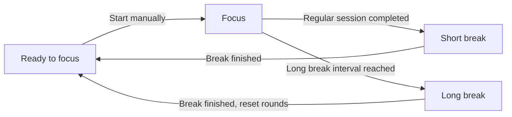

# WearPomodoro

[](docs/assets/app-icon.svg)

[简体中文](README.md) | English

[](app/build.gradle.kts)
[](gradle/libs.versions.toml)
[](LICENSE)

A standalone Pomodoro timer for Android watches, built with Kotlin, Jetpack Compose, and Wear Compose Material 3. Organize your time into focus sessions, short breaks, and long breaks without an account or a companion phone app.

## Features

- **Timer controls**: start, pause, resume, and stop with confirmation; see the remaining time, session progress, and round count.
- **Adjustable sessions**: customize focus and break durations, choose a long break interval, or disable long breaks.
- **Background timing and reminders**: a foreground service and system alarms handle phase changes. The ongoing notification offers pause, continue, and stop actions, with notifications and vibration at phase completion.
- **Ongoing Activity**: supported Wear OS systems show a timer entry on the watch face, with an animated icon in active mode and a static icon in ambient mode. The launcher's Recents section shows the current phase and countdown. Tap to return directly to the timer page.
- **Live Updates**: requests promoted timer notifications on supported systems, with a system-rendered countdown. Live Updates, Ongoing Activity, and standard notifications each have a separate channel and switch.
- **Watch interaction**: a circular progress indicator, horizontal pages, scrolling pickers, rotary crown interaction, and configurable back gestures.
- **Screen style**: choose Round or Square. The Square timer uses a rounded rectangular progress frame with an opening for the clock, retaining the phase colors, large countdown, and centered controls. Lists use scaling and morphing with `TransformingLazyColumn` for Round, or standard `LazyColumn` for Square. Back controls at the bottom of lists use an edge button for Round and a centered small circular button for Square. Square uses a straight side scroll indicator and horizontal page dots at the bottom, retaining the Round indicators' colors, rounded ends, and transitions. Page dots overlay the bottom of the home pages, which retain their full content height.
- **Local persistence**: DataStore saves settings and timer state for restoration when the app process is recreated.
- **Languages and haptics**: Chinese and English resources, with a bundled compatibility layer for Google / Xiaomi Wear scrolling haptics.

## Usage

Swipe between the three home pages: **Timer, Timer settings, and General settings**, from left to right. Tap the start button on the timer page to begin focusing.

| Setting | Default | Range |
| --- | --- | --- |
| Focus duration | 25 minutes | 1 minute to 23 hours 59 minutes |
| Short break duration | 5 minutes | 1 minute to 23 hours 59 minutes |
| Long break duration | 15 minutes | 1 minute to 23 hours 59 minutes |
| Long break interval | Every 4 focus sessions | 2–12 sessions, or Never |
| Screen style | Round | Round / Square |
| Notification style | Only Ongoing Activity enabled | Independent switches for Live Updates / Ongoing Activity / Standard notification |



- A completed focus session starts a break automatically. After the break, the next focus session waits for you to start it. Short breaks retain the round count; finishing a long break resets it.
- On the timer page, pause first, then stop and confirm to reset session progress and completed rounds. Stopping from the notification requires a second confirmation tap within 10 seconds.
- Duration changes apply when you next start a focus session. The current focus session and its break retain the durations saved at its start. Changes to the long break interval immediately affect subsequent break selection.
- When the app receives the boot broadcast after a device restart, it returns to the ready state, preserving settings and resetting timer progress and rounds.
- The Ongoing Activity appears during focus and break countdowns. Pausing or finishing a break removes the activity entry; resuming restores it, and confirming stop removes it with the persistent notification. Tapping the activity or timer notification opens the timer page; leaving a settings editor does not save an unconfirmed draft.

General settings includes screen style, a permission report, a shortcut to system app settings, back gesture options, and an About page. Choose Round or Square in **General settings → Screen style** to immediately switch the timer page and the lists in Timer settings, General settings, Screen style, Permissions, and About. The choice is saved locally. The Square timer adapts to both square and rectangular screens, with resume and stop controls in the same position when paused. The Round timer and duration / round pickers retain their existing layouts. On Android 16 / Wear OS 6 (API 36) and later, the system back gesture setting also controls swipe back; earlier versions allow separate settings.

## Device compatibility

**General settings → Notification style** offers three independent switches: **Live Updates**, **Ongoing Activity**, and **Standard notification**. Only Ongoing Activity is enabled by default. Each display uses a different notification ID and a system channel with the matching name. Enabling multiple displays posts separate notifications; a single notification never carries both Live Update and Ongoing Activity data. Switches are saved and applied immediately without changing session durations; legacy single-choice and switch values are neither read nor migrated.

The first two displays include activity data only during running focus or break sessions. Pausing or entering the ready state cancels the Ongoing Activity notification and turns Live Updates into an ordinary timer notification in its channel; resuming restores the activity. When only Ongoing Activity is enabled, the Standard notification channel retains continue and stop controls while paused. If all three switches are off, a basic service notification remains in the Standard notification channel while the timer service runs. Confirming stop removes all timer notifications. Session reminders use their own Session reminders channel and are independent of these switches.

All three channels share the current phase, countdown, and stop confirmation state: running sessions offer Pause, paused sessions show a fixed remaining time and Continue, and completed breaks show the ready state and Start. Reopening the app restores notifications for running or paused sessions; returning from system settings rechecks notification access and channels. Wall-clock changes only correct notification display times, leaving the monotonic timer deadline unchanged. Late or duplicate alarms cannot end the next phase early, and the 10-second notification stop confirmation window includes device sleep.

- Designed for Android watches with the `android.hardware.type.watch` device feature. The minimum system requirement is defined by `minSdk` in the [app build configuration](app/build.gradle.kts).
- Default builds produce `armeabi-v7a`, `arm64-v8a`, and universal APKs. The universal APK contains those two ARM architectures.
- The bundled [miwearhaptics](miwearhaptics/README.md) plugin primarily targets Wear haptics compatibility on mainland China variants of Xiaomi Watch 5 / 5 eSIM. It tries callable Google APIs first, then Xiaomi APIs. If neither provides an effect, that scrolling haptic effect is unavailable.

The minimum API setting does not establish compatibility with every device or firmware. Scrolling haptics depend on the system Wear SDK and are handled separately from session reminder vibration.

This feature uses the [Wear OS Ongoing Activity API](https://developer.android.com/training/wearables/notifications/ongoing-activity). Entry placement, animation, and countdown display depend on system, launcher, and watch face support. The activity provides monochrome icons with transparent backgrounds and an accessible description for returning to the timer. Its system-rendered countdown uses the same monotonic deadline as the app. Phase changes update the same notification ID; pausing, disabling the switch, or finishing cancels the activity notification to clear cached system entries. Unchanged state is not reposted, avoiding updates being dropped by notification rate limits. Devices without this API still use the ordinary timer notification. The activity requires app notifications and the Ongoing Activity channel to be enabled.

## Permissions and reminders

[Wear OS Live Updates](https://developer.android.com/training/wearables/notifications/live-updates) are available starting with Wear OS 7. Presentation depends on the system, device manufacturer, and system notification settings; enabling Live Updates does not guarantee promotion. If unsupported or disallowed, its channel shows an ordinary notification; Ongoing Activity can be enabled independently. A system chronometer renders the countdown without reposting notifications every second.

Open **General settings → Permissions** to inspect permission status and access the relevant system settings.

| Permission | Purpose and setup |
| --- | --- |
| Notifications: `POST_NOTIFICATIONS` | Shows the timer and session reminders. Android 13 / API 33 and later require runtime permission; system notifications must also remain enabled. |
| Live Updates: `POST_PROMOTED_NOTIFICATIONS` | Declares promotion requests without a runtime permission dialog. On API 36 and later, the permission page checks system access and links to its settings; older systems report it as not required. Display on Wear still requires system support. |
| Exact alarms: `SCHEDULE_EXACT_ALARM` | Handles phase completion while the screen is off. On Android 12 / API 31 and later, the permission page opens the system special access settings. |
| Foreground services: `FOREGROUND_SERVICE`, `FOREGROUND_SERVICE_SPECIAL_USE` | Runs the timer service. These permissions are declared in the manifest and checked according to the Android version. |

The manifest also declares boot broadcast, vibration, and wake lock permissions. These do not all require manual approval; the permission report distinguishes granted, missing, and not required on the current system.

Without exact alarm access, the app falls back to inexact alarms and reminders may be delayed. Disabled notifications, the session reminder channel, or vibration settings can affect alerts. Background behavior also depends on the device's battery management policies.

Timing works offline, with settings and timer state stored locally in DataStore. Website links on the About page open through an external app.

## Build from source

### Requirements

Use the repository's Gradle Wrapper. Application details and build requirements are defined in these configuration files:

| Configuration source | Contents |
| --- | --- |
| [App build configuration](app/build.gradle.kts) | Application details, Android SDK requirements, and Java / Kotlin compilation targets |
| [Dependency version catalog](gradle/libs.versions.toml) | Android Gradle Plugin, Kotlin, Wear Compose, and other dependencies |
| [Wrapper configuration](gradle/wrapper/gradle-wrapper.properties) | Gradle distribution |
| [JVM configuration](gradle/gradle-daemon-jvm.properties) | JDK required by the Gradle daemon |

Prepare the JDK and Android SDK specified by these files. Installing on a device also requires `adb` from SDK Platform-Tools. You can open the project in an Android Studio version that supports the project's AGP configuration. The first build needs network access to download Gradle and dependencies, and may also download a missing JDK toolchain automatically.

### Build a debug APK

1. Clone or download this repository, including the complete `miwearhaptics/` directory. Gradle uses it as an included build for plugin and runtime dependency resolution.
2. Configure the SDK through Android Studio, or set `sdk.dir` in the root `local.properties` file to your local SDK path, for example `sdk.dir=C:/Android/Sdk` on Windows. Keep this file out of version control.
3. Run the build from the project root.

Windows / PowerShell:

```powershell
.\gradlew.bat :app:assembleDebug
```

macOS / Linux:

```bash
./gradlew :app:assembleDebug
```

Debug APKs are written to `app/build/outputs/apk/debug/`: `app-armeabi-v7a-debug.apk`, `app-arm64-v8a-debug.apk`, and `app-universal-debug.apk`.

### Release build

Windows / PowerShell：

```powershell
.\gradlew.bat :app:assembleRelease
```

macOS / Linux：

```bash
./gradlew :app:assembleRelease
```

Release APKs are written to `app/build/outputs/apk/release/`, named `WearPomodoro-<version>-<ABI>.apk`, where ABI is `armeabi-v7a`, `arm64-v8a`, or `universal`.

Release builds enable code minification and resource shrinking. 

### GitHub Release

Pushing a new Git tag to GitHub triggers the [release workflow](.github/workflows/release.yml). It builds Debug APKs using the CI build process, generates release notes, and attaches only the APKs to a GitHub Release for that tag. Its Actions artifact also contains only APKs. The APK's app version continues to come from the [app build configuration](app/build.gradle.kts).

## Project structure

```text
.
├── .github/                       # Issue / PR templates, contributing guide, funding
├── app/
│   ├── build.gradle.kts            # Android app and APK output configuration
│   └── src/main/
│       ├── AndroidManifest.xml
│       ├── java/cc/star0/wear/pomodoro/
│       │   ├── model/              # Settings, state, and pure timer transitions
│       │   ├── data/               # DataStore persistence
│       │   ├── timer/              # Controller, foreground service, boot handling
│       │   ├── notifications/      # Ongoing notification and session reminders
│       │   ├── permissions/        # Permission checks and reporting
│       │   ├── text/               # Formatting shared by UI and notifications
│       │   └── ui/                 # Compose screens, navigation, and interaction
│       └── res/                    # English / Chinese resources, icons, and images
├── docs/assets/                   # App icon used in the READMEs
├── miwearhaptics/                  # Independent Gradle plugin and Java runtime
├── gradle/                        # Version catalog, Wrapper, and JVM configuration
├── settings.gradle.kts
├── README.md
├── README_en.md
└── AGENTS.md                       # Development and agent collaboration guide
```

## Contributing

Issues and pull requests are welcome. Bug reports should include the device model, firmware / Android version, app version, reproduction steps, and relevant logs. Screenshots help with UI issues.

See the [contributing guide](.github/CONTRIBUTING.md) for the process. Choose the bug report or feature request template when opening an issue.

Read [AGENTS.md](AGENTS.md) before making changes. For haptics plugin changes, also consult its [maintenance guide](miwearhaptics/AGENTS.md). Common code validation commands are:

```powershell
.\gradlew.bat :app:assembleDebug :app:lintDebug
.\gradlew.bat :app:testDebugUnitTest
```

Use `./gradlew` on macOS / Linux. Robolectric tests cover notification switch combinations and persistence, separate channels and activity data, icon resources, countdowns, phase transitions, pause/resume behavior, and notification cleanup. Watch face and launcher display, tapping back to the timer page, and changes to timing, notifications, gestures, or haptics also need validation on target devices. Keep both README languages in sync when features or build instructions change.

## Support the project

If you find this project useful, you can support development via Ko-fi or WeChat.

[](https://ko-fi.com/I1J826UQFX)

WeChat tipping code:

[](app/src/main/res/drawable-nodpi/tipcode.jpg)

## Author and licenses

Created by **星澪 Star_ZER0** · [Personal website](https://star0.cc). This app was developed with AI assistance.

- The main project is licensed under **GNU AGPL v3**; see [LICENSE](LICENSE).
- Bundled `miwearhaptics` has its own **GNU LGPL v3** license; see [miwearhaptics/LICENSE](miwearhaptics/LICENSE).
